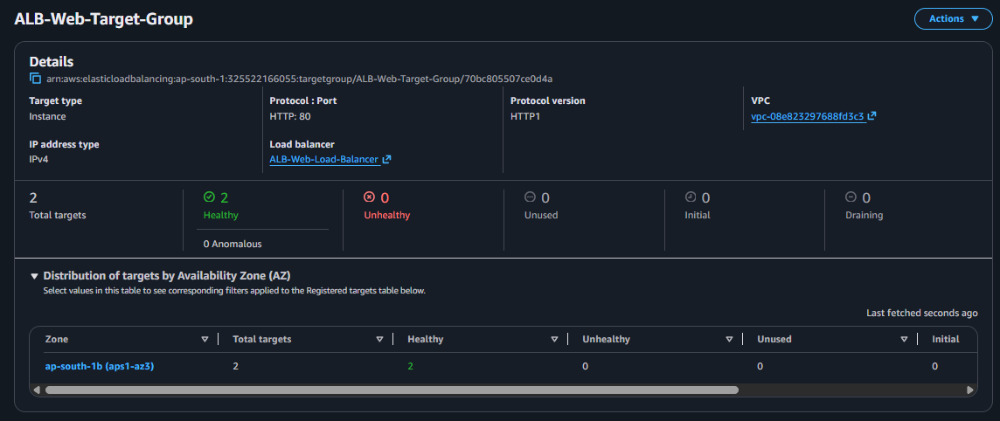
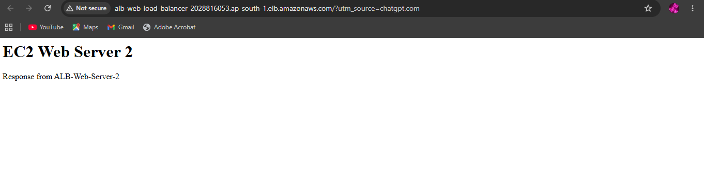

# EC2 + Application Load Balancer + Target Group

> Built a highly available web application architecture using Amazon EC2, an Application Load Balancer (ALB), and an EC2 target group, demonstrating health checks and load-balanced HTTP traffic.

## 🏗️ Architecture

```text
                         Internet
                            |
                            v
              +-------------------------+
              | Application Load        |
              | Balancer (ALB)          |
              | HTTP : 80               |
              +------------+------------+
                           |
                           v
                 +-----------------+
                 | Target Group     |
                 | HTTP : 80        |
                 +--------+---------+
                          |
                 +--------+--------+
                 v                 v
        +----------------+ +----------------+
        | EC2 Server 1   | | EC2 Server 2   |
        | Apache Web     | | Apache Web     |
        | Server         | | Server         |
        +----------------+ +----------------+
```

## 🎯 Project Objective

The objective of this project was to deploy multiple EC2 web servers behind an Application Load Balancer and use a Target Group to distribute incoming HTTP requests.

The project also validates EC2 target health using ALB health checks.

## 🛠️ AWS Services Used

- **Amazon EC2** — Backend web servers
- **Application Load Balancer (ALB)** — Distributes incoming HTTP traffic
- **Target Group** — Registers and monitors EC2 instances
- **Amazon VPC** — Network environment
- **Security Groups** — Network access control
- **Amazon Linux 2023** — EC2 operating system
- **Apache HTTP Server** — Web server

## 🔄 Implementation Workflow

1. Launched two Amazon Linux 2023 EC2 instances.
2. Installed and configured Apache HTTP Server on both instances.
3. Created separate web pages to identify each backend server.
4. Created an EC2 Target Group using HTTP port 80.
5. Registered both EC2 instances as targets.
6. Configured HTTP health checks using `/`.
7. Created an Internet-facing Application Load Balancer.
8. Configured an HTTP listener on port 80.
9. Forwarded ALB traffic to the EC2 Target Group.
10. Verified that both EC2 instances became healthy.
11. Accessed the application using the ALB DNS name.
12. Verified successful traffic delivery to an EC2 backend.

## 🧪 Health Check Validation

The Target Group successfully registered both EC2 instances:

```text
ALB-Web-Server-1 → Healthy
ALB-Web-Server-2 → Healthy
```

The final target status was:

```text
Total Targets: 2
Healthy:       2
Unhealthy:     0
Unused:        0
```


`alb-target-group-healthy-targets.png`

## 🌐 ALB Application Test

The application was accessed through the Application Load Balancer DNS name rather than directly through an EC2 public IP.

The ALB successfully forwarded the request to a healthy backend instance.


`alb-web-application.png`

## 🔐 Security Considerations

- Used a dedicated security group for the Application Load Balancer.
- Allowed HTTP traffic on port 80 to the internet-facing ALB.
- Used EC2 security groups to control backend access.
- Kept SSH access restricted to the administrator's IP during testing.
- No unnecessary NAT Gateway, RDS instance, or Elastic IP was used.

## 💰 Cost Considerations

This project was designed for a Free Tier AWS account with minimal resource usage.

Resources were created only for the duration required for testing.

To minimize costs:

- Used Free Tier-eligible EC2 instance types.
- Used minimal EBS storage.
- Avoided NAT Gateway.
- Avoided RDS.
- Avoided unnecessary Elastic IP addresses.
- Used HTTP instead of introducing additional HTTPS infrastructure.
- Deleted the Application Load Balancer after completing the demonstration.
- Terminated the two EC2 test instances after validation.
- Deleted the unused Target Group after completing the project.

> Application Load Balancers can incur charges based on usage. The ALB was therefore used only for the demonstration and removed after testing.

## 📌 Key Concepts Demonstrated

- Application Load Balancing
- EC2 target registration
- Target Groups
- ALB listeners
- HTTP routing
- Health checks
- Healthy and unhealthy target states
- Security Groups
- Load-balanced web applications
- Basic high-availability architecture
- AWS resource cleanup and cost awareness

## ✅ Project Outcome

Successfully deployed and validated an Application Load Balancer architecture with two EC2 web servers.

The final request flow was:

```text
Internet
   |
   v
Application Load Balancer
   |
   v
Target Group
   +-- EC2 Web Server 1 [Healthy]
   +-- EC2 Web Server 2 [Healthy]
```

Both EC2 targets passed ALB health checks, and the application was successfully accessed through the ALB DNS endpoint.

## 📸 Evidence

Only two screenshots are included because they provide sufficient evidence of the complete implementation:

| Screenshot                                | Evidence                                                        |
|---------------------------------------------|----------------------------------------------------------------------|
| `alb-target-group-healthy-targets.png`          | Demonstrates ALB association and 2/2 healthy EC2 targets              |
| `alb-web-application.png`                         | Demonstrates successful end-to-end access through the ALB DNS          |

## 🧹 Cleanup

After validation:

- Deleted `ALB-Web-Load-Balancer`
- Deleted `ALB-Web-Target-Group`
- Terminated `ALB-Web-Server-1`
- Terminated `ALB-Web-Server-2`
- Removed any unused security groups when confirmed they were not required by other projects
