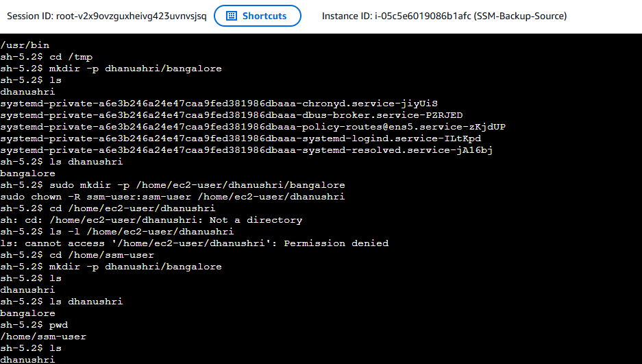
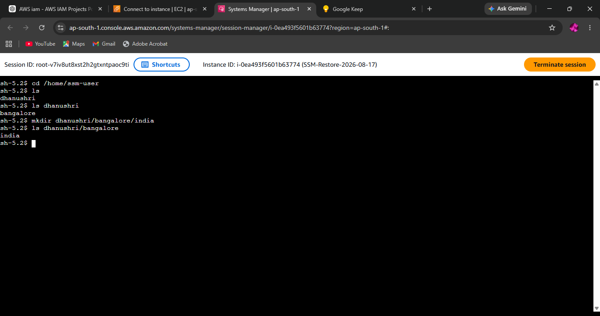

# EC2 AMI Backup & Restore

> Demonstrated an EC2 backup and recovery workflow using Amazon Machine Images (AMI), validating that an EC2 environment can be restored from a backup.

## 🏗️ Architecture

```text
                    AWS
                     |
              +-------------+
              | Source EC2  |
              |   Server    |
              +------+------+
                     |
                 Create AMI
                     |
                     v
              +-------------+
              | AMI Backup  |
              |    Image    |
              +------+------+
                     |
                 Launch AMI
                     |
                     v
              +-------------+
              | Restored EC2|
              |   Server    |
              +-------------+
```

## 🎯 Project Objective

The objective of this project was to implement and validate an EC2 backup and recovery process using Amazon Machine Images (AMI).

The workflow demonstrates how an EC2 instance can be backed up as an AMI and used to launch a new EC2 instance for recovery.

## 🛠️ AWS Services Used

- **Amazon EC2** — Compute instance
- **Amazon Machine Image (AMI)** — EC2 backup image
- **Amazon EBS** — Root volume storage used by the EC2 instance
- **AWS Systems Manager Session Manager** — Secure access to EC2 instances without requiring SSH

## 🔄 Implementation Workflow

1. Launched an Amazon Linux EC2 instance as the backup source.
2. Accessed the source instance using AWS Systems Manager Session Manager.
3. Created test data on the source EC2 instance.
4. Created an AMI from the source EC2 instance.
5. Used the AMI to launch a new EC2 instance.
6. Connected to the restored instance using Session Manager.
7. Verified the restored environment and data.
8. Terminated unnecessary EC2 resources after testing to minimize AWS costs.

## 🧪 Backup & Restore Validation

### 1. AMI Backup Created

The source EC2 instance was captured as an Amazon Machine Image, providing a reusable backup from which a new EC2 instance could be launched.


`ami-backup-created.png`

### 2. Restored EC2 Verification

The AMI was used to launch a separate EC2 instance, which was accessed through Systems Manager Session Manager to verify the restored environment.


`ec2-restore-verification.png`

## 🔐 Security Considerations

- Used **AWS Systems Manager Session Manager** for instance access.
- Avoided storing SSH credentials directly on the server.
- Used a separate restored instance rather than modifying the original backup source.
- Removed unnecessary resources after testing to reduce potential AWS charges.

## 💰 Cost Considerations

This project was designed for an AWS Free Tier environment.

To minimize costs:

- Used a Free Tier-eligible EC2 instance type.
- Used a minimal EBS volume.
- Created only the required AMI.
- Avoided unnecessary additional EC2 instances.
- Terminated test instances after validation.
- Deleted unused AMIs and associated EBS snapshots after completing the project.

> AMIs backed by EBS snapshots can continue to consume storage even after an EC2 instance is terminated. Unused AMIs and their associated snapshots should therefore be cleaned up after testing.

## 📌 Key Concepts Demonstrated

- EC2 backup and recovery
- Amazon Machine Images (AMI)
- EBS-backed EC2 instances
- EC2 instance restoration
- Disaster recovery fundamentals
- Systems Manager Session Manager
- Backup validation
- Resource cleanup and cost awareness

## ✅ Project Outcome

Successfully demonstrated an EC2 backup and recovery workflow:

```text
EC2 Source
    |
    v
Create AMI
    |
    v
AMI Backup
    |
    v
Launch New EC2
    |
    v
Restore & Verify
```

The project demonstrates a basic but practical cloud recovery strategy for EC2 workloads.

## 📸 Evidence

Only the following evidence is included to demonstrate the core functionality:

| Evidence                        | Purpose                                            |
|----------------------------------|-------------------------------------------------------|
| `ami-backup-created.png`             | Proves the EC2 AMI backup was created                   |
| `ec2-restore-verification.png`         | Proves the environment was restored and verified          |

## 🧹 Cleanup

After completing the demonstration:

- Terminate the restored EC2 instance.
- Terminate the source EC2 instance if it is no longer required.
- Deregister the test AMI.
- Delete the EBS snapshot associated with the AMI if no longer required.
- Remove other unused resources created specifically for this project.
