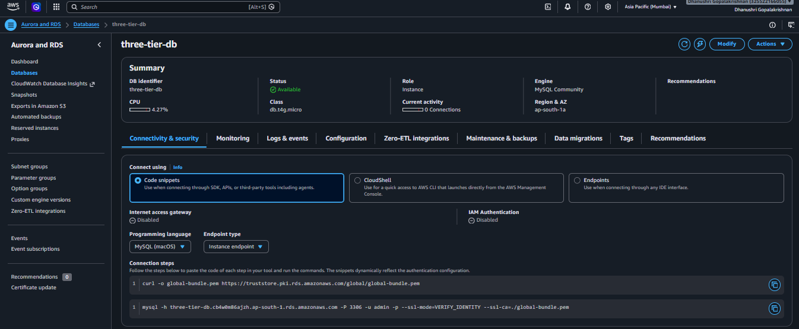
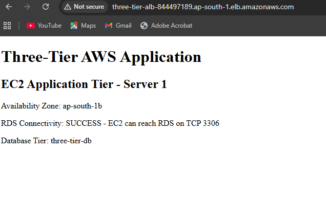

# Secure 3-Tier AWS Architecture

> Designed and implemented a secure 3-tier AWS architecture using Amazon VPC, an Application Load Balancer, private EC2 application servers, and a private Amazon RDS MySQL database. The project demonstrates network segmentation, security-group-based access control, load balancing, and end-to-end application-to-database connectivity.

## 🏗️ Architecture Diagram

```text
                         Internet
                            |
                            v
                 +---------------------+
                 |  Application Load   |
                 |      Balancer       |
                 |    HTTP : 80        |
                 +----------+----------+
                            |
                  +---------+---------+
                  |                   |
                  v                   v
          +---------------+   +---------------+
          | EC2 App       |   | EC2 App       |
          | Server 1      |   | Server 2      |
          | Private       |   | Private       |
          | HTTP : 80     |   | HTTP : 80     |
          +-------+-------+   +-------+-------+
                  |                   |
                  +---------+---------+
                            |
                         TCP : 3306
                            |
                            v
                 +---------------------+
                 |     Amazon RDS      |
                 |    MySQL Database   |
                 |    three-tier-db    |
                 |   Private Access    |
                 +---------------------+
```

## 🛠️ Tech Stack & AWS Services

- **Networking:** Amazon VPC
- **Load Balancing:** Application Load Balancer
- **Compute:** Amazon EC2
- **Database:** Amazon RDS for MySQL
- **Security:** Amazon VPC Security Groups
- **Operating System:** Amazon Linux 2023
- **Application:** Python HTTP Server
- **Region:** AWS Mumbai (`ap-south-1`)

## 🌐 VPC Configuration

- **VPC Name:** `Three-Tier-VPC-vpc`
- **CIDR:** `10.0.0.0/16`
- **Internet Gateway:** `Three-Tier-VPC-igw`
- **NAT Gateway:** Not used
- **Public Subnets:** 2
- **Private Subnets:** 2
- **Availability Zones:** `ap-south-1a` and `ap-south-1b`
- **S3 VPC Endpoint:** Configured

### Public Subnets

| Subnet   | Availability Zone | Purpose                     |
|------------|----------------------|----------------------------------|
| Public1        | `ap-south-1a`             | Application Load Balancer            |
| Public2        | `ap-south-1b`             | Application Load Balancer            |

### Private Subnets

| Subnet    | Availability Zone | Purpose                       |
|-------------|----------------------|------------------------------------|
| Private1        | `ap-south-1a`             | Application / Database Tier            |
| Private2        | `ap-south-1b`             | Application / Database Tier            |

## ⚖️ Application Load Balancer

**Load Balancer:** `Three-Tier-ALB`

| Setting              | Value                    |
|------------------------|------------------------------|
| Type                        | Application Load Balancer     |
| Scheme                       | Internet-facing                 |
| IP Address Type               | IPv4                              |
| Listener                        | HTTP `80`                          |
| Target Group                     | `Three-Tier-App-TG`                 |
| Target Type                        | Instance                              |
| Protocol                             | HTTP                                    |
| Port                                    | `80`                                      |
| Health Check Path                         | `/`                                          |
| Success Code                                | `200`                                          |

The target group successfully reported:

```text
Total Targets: 2
Healthy: 2
Unhealthy: 0
```

## 💻 EC2 Application Tier

Two Amazon Linux 2023 EC2 instances were deployed as private application servers.

| Setting          | Application Server 1        | Application Server 2        |
|---------------------|----------------------------------|----------------------------------|
| Name                     | `Three-Tier-App-Server-1`             | `Three-Tier-App-Server-2`             |
| Instance Type              | `t3.micro`                              | `t3.micro`                              |
| Private IP                   | `10.0.159.70`                             | `10.0.159.228`                            |
| Availability Zone               | `ap-south-1b`                               | `ap-south-1b`                               |
| Port                               | `80`                                           | `80`                                           |
| Public IP                            | None                                              | None                                              |

The application was implemented using Python's built-in HTTP server, allowing the private EC2 instances to serve the application without requiring package downloads from the Internet.

## 🗄️ RDS Database Tier

**Database Identifier:** `three-tier-db`

| Setting            | Value                          |
|-----------------------|-------------------------------------|
| Engine                    | MySQL Community                        |
| Version                     | MySQL 8.4                                |
| Instance Class                 | `db.t4g.micro`                              |
| Storage                          | 20 GiB                                        |
| Port                                | `3306`                                          |
| Public Access                         | No                                                 |
| Availability Zone                        | `ap-south-1a`                                        |
| DB Subnet Group                             | `three-tier-db-subnet-group`                            |
| Security Group                                 | `Three-Tier-RDS-SG`                                        |

The RDS database is placed in a private configuration and is accessible from the EC2 application tier through TCP port `3306`.

## 🔐 Security Architecture

Separate security groups were created for each application tier.

### ALB Security Group — `Three-Tier-ALB-SG`

- HTTP `80` from `0.0.0.0/0`
- Outbound traffic allowed

### EC2 Security Group — `Three-Tier-EC2-SG`

- HTTP `80` allowed only from `Three-Tier-ALB-SG`
- No direct public IP addresses
- Outbound traffic allowed

### RDS Security Group — `Three-Tier-RDS-SG`

- MySQL `3306` allowed only from `Three-Tier-EC2-SG`
- Database is not publicly accessible

### Security Flow

```text
Internet
   |
   | HTTP :80
   v
ALB Security Group
   |
   | HTTP :80
   v
EC2 Security Group
   |
   | MySQL :3306
   v
RDS Security Group
```

## 🧪 Testing & Validation

### ALB Target Health

The Application Load Balancer successfully detected both EC2 application servers as healthy.

```text
2 Total Targets
2 Healthy
0 Unhealthy
0 Initial
```

### Application Test

The application was accessed through the ALB DNS name and returned:

```text
Three-Tier AWS Application

EC2 Application Tier - Server 1
Availability Zone: ap-south-1b
RDS Connectivity: SUCCESS - EC2 can reach RDS on TCP 3306
Database Tier: three-tier-db
```

The ALB request successfully returned:

```text
HTTP/1.1 200 OK
```

### End-to-End Flow

```text
Client
  |
  v
Application Load Balancer
  |
  v
Private EC2 Application Server
  |
  v
Private RDS MySQL Database
```

## 📸 Screenshots

### 1. RDS Private Database


`rds-private-database.png`

Shows the RDS database configuration, MySQL engine, instance class, availability status, and private database configuration.

### 2. ALB Target Group — Healthy Targets


`alb-target-group-healthy-targets.png`

Shows the Application Load Balancer target group with **2/2 healthy EC2 targets**.

### 3. ALB → EC2 → RDS Connectivity


`alb-ec2-rds-connectivity.png`

Shows the application successfully responding through the ALB and confirming **EC2-to-RDS connectivity**.

## 🎯 Key Learning Outcomes

- Designed a multi-tier AWS cloud architecture
- Created and configured a custom VPC
- Implemented public and private subnet segmentation
- Configured Internet Gateway and route tables
- Deployed an Internet-facing Application Load Balancer
- Configured target groups and health checks
- Deployed private EC2 application servers
- Implemented security-group-based tier isolation
- Deployed a private Amazon RDS MySQL database
- Configured EC2-to-RDS connectivity
- Tested end-to-end ALB → EC2 → RDS communication
- Used a cost-conscious architecture without a NAT Gateway

## 💰 Cost Optimization

The architecture was designed with cost awareness:

- No NAT Gateway was deployed
- EC2 instances use `t3.micro`
- RDS uses `db.t4g.micro`
- Application servers have no public IP addresses
- Monitoring features not required for the demonstration were disabled
- Billable resources should be deleted after project testing

## 🧹 Cleanup

After completing the demonstration:

- Delete `Three-Tier-ALB` and its associated listener.
- Delete `Three-Tier-App-TG` target group.
- Terminate `Three-Tier-App-Server-1` and `Three-Tier-App-Server-2`.
- Delete the `three-tier-db` RDS instance (and its final snapshot, if retained).
- Delete the VPC (`Three-Tier-VPC-vpc`), subnets, Internet Gateway, and S3 VPC Endpoint if not required by other projects.
- Remove associated security groups once confirmed they are not in use elsewhere.

## 🚀 Project Outcome

Successfully implemented and validated a secure 3-tier AWS architecture:

**Internet → Application Load Balancer → Private EC2 Application Tier → Private RDS MySQL Database**

The project demonstrates practical AWS skills in VPC networking, subnet segmentation, security groups, EC2, Application Load Balancer, target-group health checks, Amazon RDS, and end-to-end cloud application connectivity.
